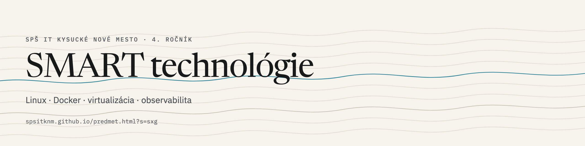

  <picture>
    <source media="(prefers-color-scheme: dark)"  srcset="assets/banner-sxg-dark.png">
    <source media="(prefers-color-scheme: light)" srcset="assets/banner-sxg-light.png">
    
  </picture>

# SXG — SMART technológie

Repozitár predmetu **SXG** na SPŠ IT Kysucké Nové Mesto (4. ročník). Materiály k Linuxu,
kontajnerizácii, virtualizácii a verzionovaniu. Web ich renderuje priamo.

**→ [spsitknm.github.io/predmet.html?s=sxg](https://spsitknm.github.io/predmet.html?s=sxg)**
· [čítačka](https://spsitknm.github.io/citacka.html?s=sxg&doc=docker)
· [hub](https://spsitknm.github.io)
· [Discord](https://discord.gg/eSQDsna4d7)

## Obsah

| Súbor | Čo je vnútri |
|-------|--------------|
| `docker.md` | Architektúra, images vs kontajnery, Compose, siete, swarm |
| `Uvod_do_operacnych_systemov.md` | Procesy, PCB, fork, exec, pipe, wait a zombie |
| `git_github_gitlab.md` | Verzionovanie, merge konflikty, CI/CD pipeline |
| `kvm.md` | KVM/QEMU, validácia virtualizácie, Tuned |
| `otel.md` | OpenTelemetry — signály, traces, metrics, logs |
| `Linux Commands Cheat Sheet.md`, `fedora_commands.md` | Referencie príkazov |
| `VirtualBox Guide.md` | Inštalácia a konfigurácia VM |
| `Makefile.md` | Automatizácia prekladu |
| `tips_and_tricks` | SSH a ECDSA kľúče *(súbor bez prípony — web ho renderuje ako Markdown)* |

Zoznam a metadáta na webe pochádzajú z
[`content/sxg.json`](https://github.com/SPSITKNM/SPSITKNM.github.io/blob/main/content/sxg.json).

---

*Tomáš Mucha · SPSITKNM · 2025/2026 · „Non scholae, sed vitae discimus"*
